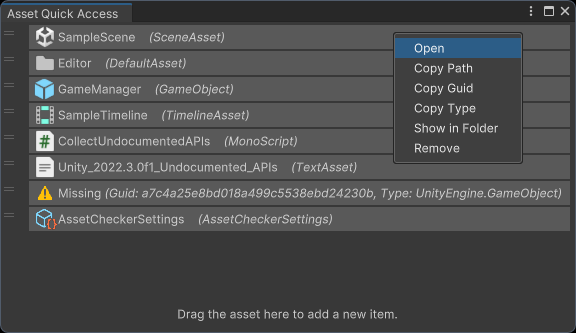

# Unity资产快速访问工具

[English](./README.md)

将常用的 **Unity对象、菜单项和外部文件/文件夹/网址** 固定到独立的编辑器窗口中。Unity Favorites功能的增强版。

## 功能

- 记录常用对象，包括：
  - 项目资产
  - Scene中的对象和组件
  - 外部文件和文件夹
  - 网址（文本内容）
  - 菜单项（路径）
- 按类别筛选已记录项目
- 快速 定位 / 打开 已记录项目
- 复制已记录项目路径
- 复制已记录项目Guid
- 复制已记录项目类型
- 在文件夹中显示已记录项目

## 支持的Unity版本

Unity 2021.3 或更新版本。

Unity 2019.2 - Unity 2021.2请使用 [v1.4.3](https://github.com/SolarianZ/UnityAssetQuickAccessTool/releases/tag/v1.4.3) 版本。 
Unity 2017.4 - Unity 2019.1请使用 [v1.2.1](https://github.com/SolarianZ/UnityAssetQuickAccessTool/releases/tag/v1.2.1) 版本。

## 安装

从 [OpenUPM](https://openupm.com/packages/com.greenbamboogames.assetquickaccess) 安装，或者直接将此仓库克隆到项目的Packages文件夹下。

## 如何使用

从菜单 **Tools/Bamboo/Asset Quick Access** 或者快捷键 `Ctrl Q` 打开资产快速访问工具窗口。

- 将项目 **拖放** 到工具窗口中，可以记录该项目。
- 在Unity对象上下文菜单中，选择 **Bamboo/Add to Asset Quick Access** ，可以记录该对象。
- 使用 **鼠标左键单击** 已记录项目，可以在Editor中定位（Ping）此项目。
  - 若项目是Scene中的对象或组件，且Scene未打开，则改为定位其所在的SceneAsset；
  - 若项目是外部文件或文件夹，则什么都不做。
- 使用 **鼠标左键双击** 已记录项目，可以打开/执行此项目。
  - 若项目是Scene中的对象或组件，且Scene未打开，则打开其所在的SceneAsset。
- 使用 **鼠标右键单击** 已记录项目，可以显示项目操作菜单。
- ~~在 **Find Asset** 输入框中输入资产的Guid或路径查找资产~~ （使用Unity内置的搜索功能(`Ctrl K`)替代）。
- 使用窗口工具栏的类别按钮筛选项目
- 使用窗口工具栏下拉菜单中的 **Add External File** 选项添加一个外部文件。
- 使用窗口工具栏下拉菜单中的 **Add External Folder** 选项添加一个外部文件夹。
- 使用窗口工具栏下拉菜单中的 **Add URL** 选项添加一个外部链接。
- 使用窗口工具栏下拉菜单中的 **Remove All Items** 选项清除已记录的所有项目。

若要禁用快捷键，请在 **Edit > Project Settings > Player** 中添加 [脚本编译条件符号](https://docs.unity3d.com/Manual/CustomScriptingSymbols.html) `GBG_AQA_HOTKEY_OFF` 。也可以通过 [Shortcuts Manager](https://docs.unity3d.com/Manual/ShortcutsManager.html) 调整快捷键。

若要禁用Unity对象上下文菜单项，请在 **Edit > Project Settings > Player** 中添加 [脚本编译条件符号](https://docs.unity3d.com/Manual/CustomScriptingSymbols.html) `GBG_AQA_CONTEXT_MENU_OFF` 。

## 已知问题

1. 无法将工程文件夹（`Application.dataPath`）中的文件和文件夹拖拽到快速访问窗口，因为Unity没有为此类项目提供对外的拖拽回调。
   - 解决方案：使用工具栏下拉菜单中的添加外部项选项替代拖拽。
2. Play Mode中动态生产的对象被删除后，再次生成同等对象（类型、路径等均相同），快速访问工具无法将两者对应起来，会认为前者处于Missing状态。