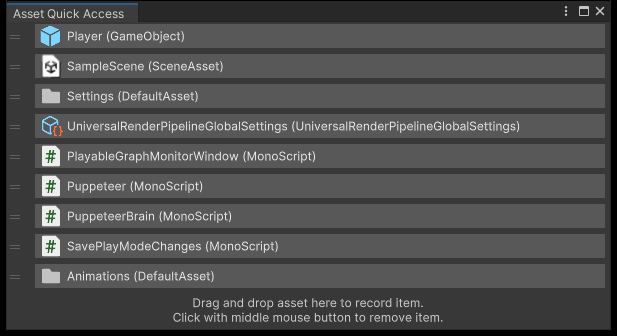

# Unity资产快速访问工具

[English](./README.md)

## 支持的Unity版本

Unity 2017.4 或更新版本。

## 安装

从 [OpenUPM](https://openupm.cn/packages/com.greenbamboogames.assetquickaccess) 安装。

## 如何使用

从 **菜单** “Window/Asset Management/Asset Quick Access Window” 打开资产快速访问工具窗口。

将资产 **拖放** 到窗口中来记录资产。

使用 **鼠标左键单击** 资产，可以在Project窗口中定位（Ping）此资产。

使用 **鼠标左键双击** 资产，可以打开此资产。

使用 **鼠标中键点击** 资产，可以从窗口中移除此资产。

使用窗口右上角的 **菜单** 中的 “Clear all assets” 选项可以清除窗口中记录的所有资产。
