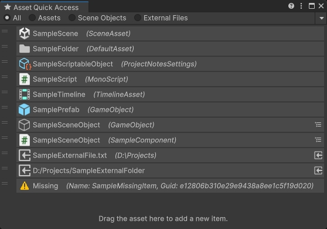

# Unity资产快速访问工具

[English](./README.md)

将常用对象固定到独立的编辑器窗口中。Unity Favorites功能的增强版。

## 功能

- 记录常用资产
- 快速定位/打开常用资产
- 复制资产路径
- 复制资产Guid
- 复制资产类型
- 在文件夹中显示资产

## 支持的Unity版本

Unity 2021.3 或更新版本。

Unity 2021.2及更低版本的Unity请使用 [1.2.1](https://github.com/SolarianZ/UnityAssetQuickAccessTool/releases/tag/v1.2.1) 版本。

## 安装

从 [OpenUPM](https://openupm.cn/packages/com.greenbamboogames.assetquickaccess) 安装，或者直接将此仓库克隆到项目的Packages文件夹下。

## 如何使用

从菜单 “Tools/Bamboo/Asset Quick Access 打开资产快速访问工具窗口。

- 将资产 **拖放** 到窗口中来记录资产。
- 使用 **鼠标左键单击** 已记录的资产，可以在Project窗口中定位（Ping）此资产。
- 使用 **鼠标左键双击** 已记录的资产，可以打开此资产。
- 使用 **鼠标右键单击** 已记录的资产，可以显示资产操作菜单。
- ~~在 **Find Asset** 输入框中输入资产的Guid或路径查找资产~~ （使用Unity内置的搜索功能(`Ctrl K`)替代）。
- 使用窗口上下文菜单中的 “Clear All Items” 选项可以清除窗口中记录的所有资产。
